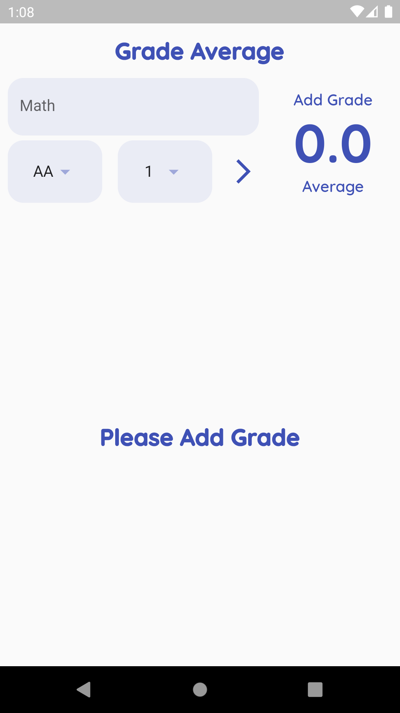
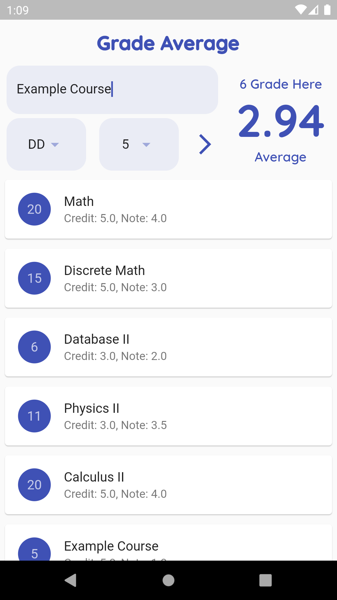

# Zodiac Guide App
This project is the second one of my new simple Flutter projects.

## Features
- Input your course names, credits, and grades to see your average.

## Screenshots
Screenshot                 | Screenshot                
:-------------------------:|:-------------------------:
 | 

### Installing
* [RELEASES](https://github.com/cusufcan/grade_average_app/releases/tag/flutter)

### Local Installing
* Just clone the repo.

## Built With
* [Flutter](https://flutter.dev/) - Flutter

## Authors
* [**Yusuf Can Mercan**](https://github.com/cusufcan)
